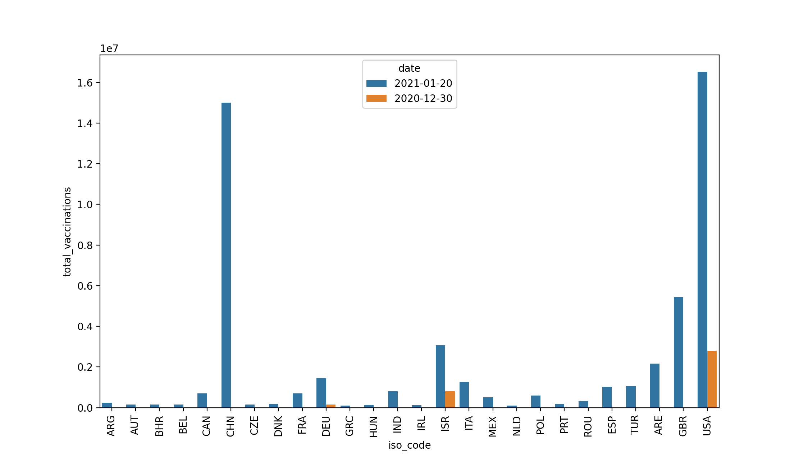

## My Analysis of the _"country-vaccinations"_ csv

 Inside of the _"country-vaccinations"_ csv, I chose to look at several groups of varaibles. For the first part I narrowed down the countries I was looking at to the US, England, Germany, and Israel. I chose these countries because they all have different strengths and weaknesses when it comes to COVID, and I wanted to dig deeper into whether the vaccinations fell into either of these cateogories. I looked at their daily vaccinations over the dataset time period, their total vaccinations over the time period, and their vaccinations per 100 people over the time period. Using several different graphs, I was able to get a good general idea of these countries' vaccine situations. Looking at the total vaccinations first Ignoring the single outlier that occured due to a glitch with the dating, we can see that the US has slowly but exponentially increased its lead over the rest of the countries, while England, then Israel, then Germany follow. Moving on to the daily vaccinations, we see a similar trend when looking at raw numbers: However, we see that Israel briefly dipped in its vaccination distribution, so it could have even overtaken England if it had stayed at its distribution numbers. However, one thing that I have yet to address is the fact that the US is much larger than any of these other countries. For example, when looking at the daily vaccinations scaled to the population, things look much different: Israel is leading the rest of the countries, even when its distribution dropped to the same numbers as Germany, when scaled for its smaller population. This is a continued trend looking at the vaccinations per 100 people: Here, the changing colors correspond to the passage of time, and while England and the US, and especially Germany, are struggling to get above 10% vaccinated, Israel surpassed that benchmark long ago and has only kept climbing to 40 vaccinations per 100 people.

 Additionally, I decided to look at two more general statistics, not limited to just those four countries. The amount of vaccines distributed has risen at a great rate over the course of the dataset, both objectively and scaled to the population, as can be seen in these two graphs: 

## Conclusions

 Now that I've given context and explained the graphs I created and the variables I looked it, it's time to draw some conclusions. The last two graphs I provided help to generalize the more specific data given in the first section. With these last two graphs, we can confirm that the US is at the top of the total vaccinations, and Israel is at the top when scaled to their population. What this tells us is two things. First, America has the most infrastructure and drive to quickly give out the vaccine. Not only are they currently leading in the total vaccines given, but they have been and likely will continue to be for some time. Second, Israel is being most efficient in their vaccine distribution across the globe. Not only are they head and shoulders above any of the competition in vaccines per hundred, but they are fourth in overall vaccines distributed, despite their small size. I intentionally graphed Germany and England to get a sense of the deviation of the variables I would be looking at. Only limiting to the world leaders in both vaccine categories would limit the scope to which I could understand them. Through this I learned that the US and Israel are certainly both outliers and way ahead of the rest of the world in current vaccine distribution. Whether this will continue to be true, only time will tell.